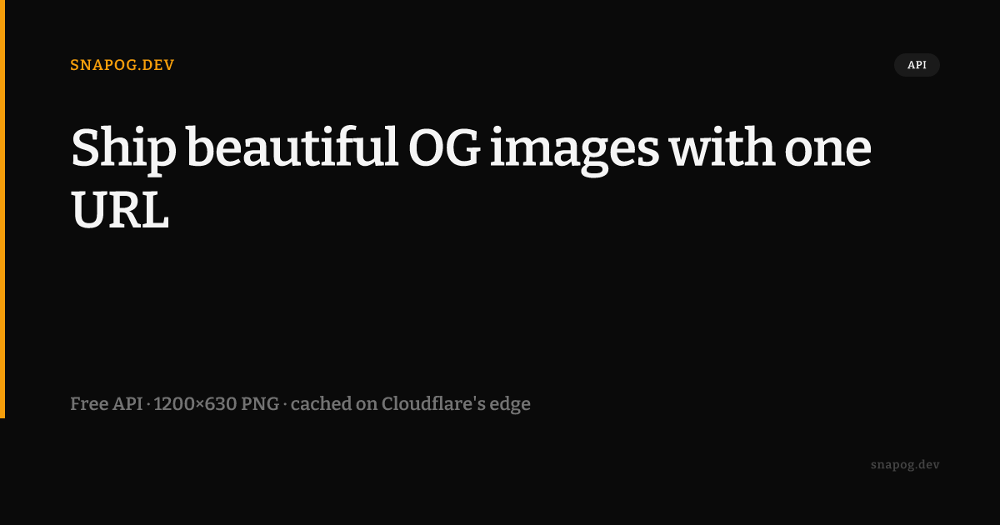

# OGStamp

Generate stunning Open Graph images via API — hosted on Cloudflare Workers, cached globally on R2, sub-100ms on cache hit.

**Live:** https://ogstamp.drzerk88.workers.dev — grab a free key at [/register](https://ogstamp.drzerk88.workers.dev/register), no credit card.



*This image was generated by the live API — one GET request, no headless browser, no design tool.*

## Quick Start

```bash
# Get a free API key at https://ogstamp.drzerk88.workers.dev/register, then:
curl "https://ogstamp.drzerk88.workers.dev/og?title=My+Blog+Post&domain=myblog.com&key=sk_YOUR_KEY" \
  --output og.png && open og.png
```

## API

```
GET /og
  ?title=Your Page Title     # required, max 120 chars
  &key=sk_your_key           # required
  &description=Subtitle      # optional, max 200 chars
  &domain=yourdomain.com     # optional
  &author=Jane Doe           # optional
  &tag=Tutorial              # optional, shown as pill badge
  &template=default          # default | blog | article
  &theme=dark                # dark | light
```

Returns `image/png`, 1200×630.

Headers:
- `X-Cache: HIT|MISS` — whether served from R2 cache
- `X-OGStamp-Tier: free|pro|business`

## HTML Integration

```html
<meta property="og:image"
      content="https://ogstamp.drzerk88.workers.dev/og?title=YOUR_TITLE&key=YOUR_KEY" />
<meta property="og:image:width"  content="1200" />
<meta property="og:image:height" content="630" />
<meta name="twitter:card"   content="summary_large_image" />
<meta name="twitter:image"  content="https://ogstamp.drzerk88.workers.dev/og?title=YOUR_TITLE&key=YOUR_KEY" />
```

## Pricing

| Tier | Price | Renders/month |
|------|-------|-------------|
| Free | $0 | 1,000 |
| Pro | $19/mo | 10,000 |
| Business | $49/mo | 100,000 |

Quota meters *renders* (cache misses). Cache hits are free to serve and do not
count. No tier watermarks its output — only the keyless `/demo/og` preview does.

## Local Development

### Prerequisites
- Node.js 18+, npm
- Wrangler (`npm install -g wrangler`)
- A Cloudflare account with Workers access

### Setup

```bash
cd projects/ogstamp
npm install

# 1. Create D1 database
wrangler d1 create ogstamp-db
# Copy the returned database_id into wrangler.toml [d1_databases]

# 2. Apply migrations locally
npm run db:local

# 3. Create R2 bucket (local R2 is simulated)
# No setup needed for local dev — wrangler simulates R2

# 4. Start dev server
npm run dev
```

Open http://127.0.0.1:8787

### Test

```bash
# Register a key via browser at http://127.0.0.1:8787/register
# Then test with:
API_KEY=sk_your_key bash sample/smoke-test.sh

# Or direct curl:
curl "http://127.0.0.1:8787/og?title=Hello+World&key=sk_your_key" --output og.png
```

### Typecheck

```bash
npm run typecheck
```

## Deployment

```bash
# 1. Create remote D1 database
wrangler d1 create ogstamp-db
# Update wrangler.toml with the database_id

# 2. Apply migrations to remote
npm run db:remote

# 3. Create R2 bucket
wrangler r2 bucket create ogstamp-og-cache

# 4. Deploy
wrangler deploy
```

## Tech Stack

- [Cloudflare Workers](https://workers.cloudflare.com/) — edge compute
- [Hono](https://hono.dev/) — HTTP framework
- [workers-og](https://github.com/nicholasgasior/workers-og) — OG image generation (Satori-based)
- [Cloudflare D1](https://developers.cloudflare.com/d1/) — SQLite for usage tracking
- [Cloudflare R2](https://developers.cloudflare.com/r2/) — image cache storage
